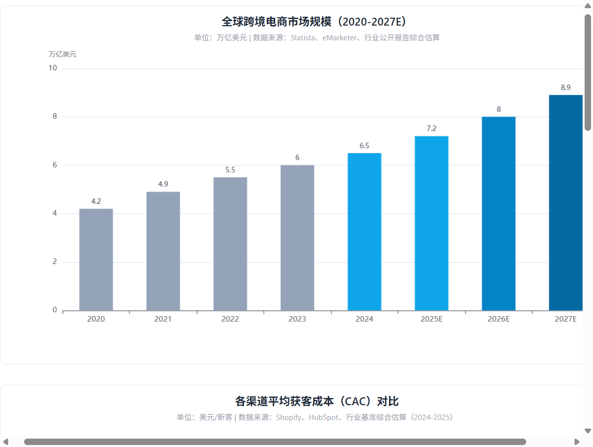
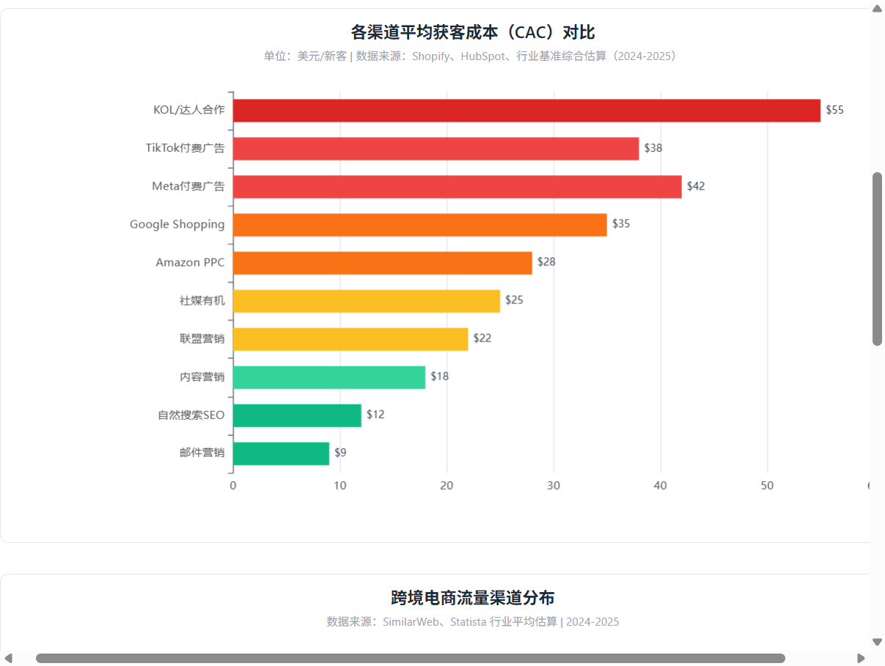
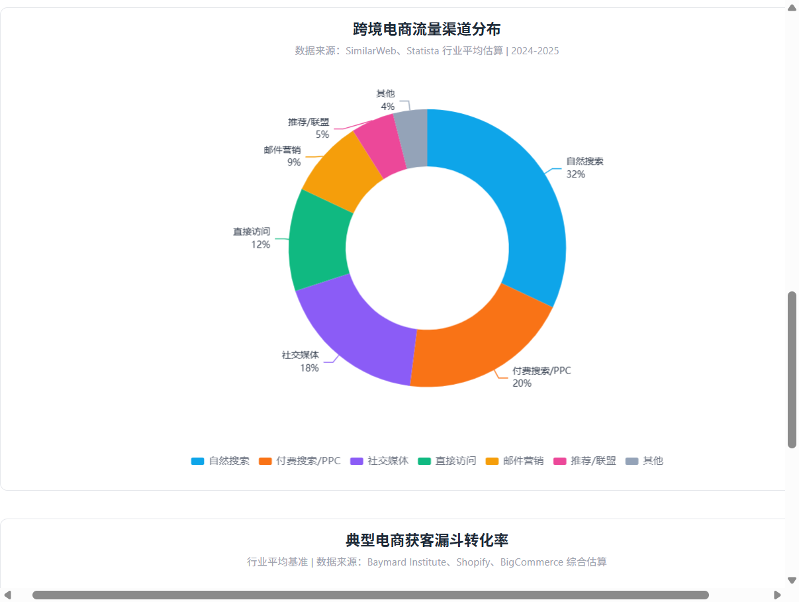
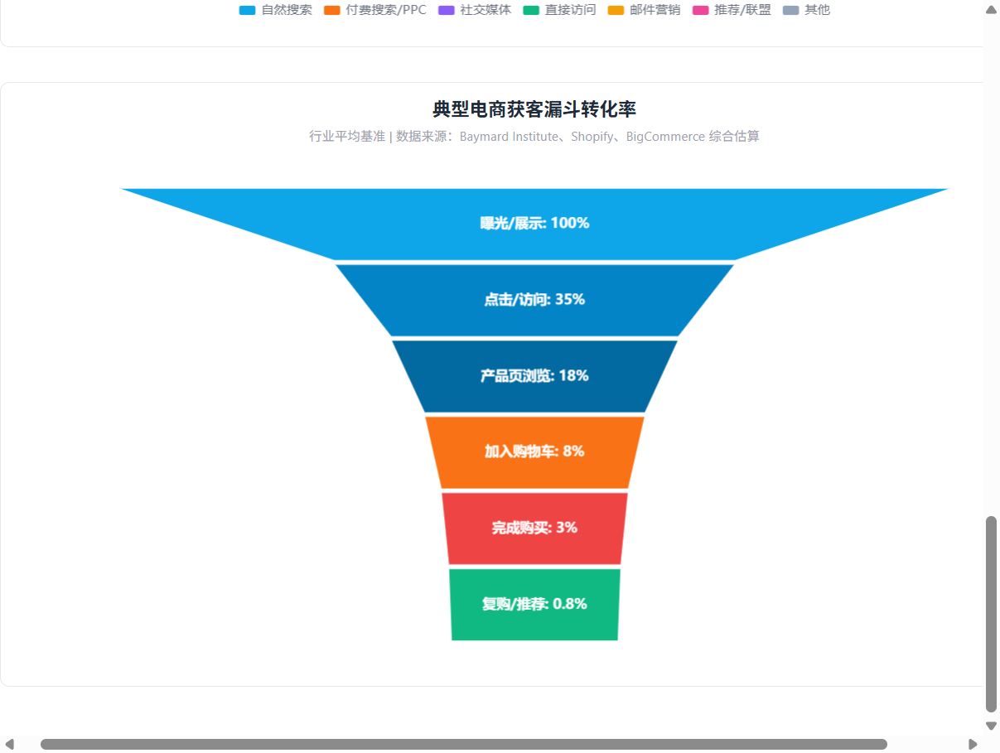

<div align="center">


# Ecommerce Customer Acquisition

**跨境电商全渠道自动获客与流量增长 Skill**

覆盖 Amazon、Shopify/DTC、TikTok Shop、Shopee/Lazada、Walmart、Etsy、Google Shopping 等全球主流平台，提供从受众洞察、关键词布局、付费投放、社媒引流、KOL合作到漏斗优化的完整获客方法论。

[](https://opensource.org/licenses/MIT)
[]()
[]()

</div>

---

## 核心价值

跨境电商获客面临**流量成本攀升、渠道碎片化、转化率低、数据孤岛**四大痛点。本 Skill 将获客拆解为可执行的标准化流程，帮助卖家：

- **降低 CAC**：通过渠道组合优化和漏斗精益运营，将单客获取成本控制在健康区间
- **提升 ROAS**：数据驱动的广告投放与创意迭代，最大化每一分预算的回报
- **全渠道覆盖**：付费 + 自然 + 社媒 + KOL + 邮件 + 联盟，构建抗风险的流量矩阵
- **本地化运营**：针对不同国家/地区的平台生态、消费习惯、支付方式提供差异化策略

---

## 核心能力模块

### 1. 受众洞察与画像构建
- 6 维度客户画像（人口统计 / 心理特征 / 行为 / 痛点 / 媒介消费 / 购买旅程）
- RFM 分层与人群细分
- 受众-渠道映射矩阵
- ICP（理想客户画像）定义与优先级排序

### 2. 关键词研究与 SEO
- 7 类关键词分类法（品牌 / 品类 / 产品 / 问题解决 / 对比 / 长尾 / 本地化）
- 搜索意图识别（信息 / 导航 / 商业 / 交易）
- Amazon A9/A10、Google、TikTok 多平台关键词策略
- 关键词聚类与内容支柱规划

### 3. 竞品流量逆向工程
- 7 维度竞品分析（流量来源 / 自然搜索 / 付费广告 / 社媒 / KOL / 邮件 / 转化UX）
- 竞品差距识别与机会挖掘
- 分场景逆向打法（竞品主导自然搜索 / 付费广告 / 社媒时的应对策略）

### 4. 付费广告投放
- **Amazon PPC**：SP/SB/SD  campaign 结构、竞价策略、ACOS 优化
- **Meta Ads**：CBO 结构、受众分层、创意测试框架、DPA 再营销
- **TikTok Ads**：Spark Ads、原生创意原则、像素事件优化
- **Google Ads**：Search / Shopping / Performance Max、智能出价
- 预算分配模型与 KPI 基准

### 5. 社交媒体有机引流
- TikTok / Instagram / Pinterest / YouTube / Facebook / Reddit 平台策略
- 内容支柱与发布节奏
- 跨平台内容原子化复用
- 算法适配与增长战术

### 6. KOL / 达人营销
- 5 级达人分层（Nano / Micro / Mid / Macro / Mega）
- 达人筛选标准与发现渠道
- 外联模板与合作模型（付费 / 置换 / 联盟 / 大使 / 白名单）
- ROI 计算与追踪方法

### 7. 内容营销
- 内容支柱定义与 SEO 文章模板
- 内容日历规划
- 线索磁铁与邮件捕获
- 博客 / 视频 / 播客 / 客座文章分发策略

### 8. 转化漏斗诊断与优化
- 全漏斗指标体系（曝光 → 点击 → 浏览 → 加购 → 结账 → 购买 → 复购）
- 漏点诊断方法论
- 各阶段优化手册（CTR / 跳出率 / 加购率 / 弃 cart 率 / 转化率 / 复购率）
- 快速审计模板

### 9. 邮件营销与再营销
- 6 大自动化邮件流（欢迎 / 弃 cart / 浏览放弃 / 购后 / 赢回 / 促销）
- 再营销受众分层与频次控制
- 邮件合规（CAN-SPAM / GDPR / CASL）

### 10. 风险与合规
- 各平台广告政策合规
- FTC 达人披露要求
- GDPR / CCPA 数据隐私
- 知识产权风险（商标 / 版权 / 专利）
- 账户安全与危机响应

---

## 目录结构

```
ecommerce-customer-acquisition/
├── SKILL.md                          # 主文件：核心工作流、质量门、输入规则、交接规则
├── README.md                         # 项目说明（本文件）
├── .gitignore
└── references/
    ├── traffic-channel-map.md        # 12大流量渠道全景 + 按预算/产品/市场选型
    ├── audience-persona.md           # 客户画像6维度 + RFM分层 + 渠道映射
    ├── keyword-research.md           # 关键词分类法 + 研究流程 + 多平台策略
    ├── competitor-traffic-analysis.md # 竞品7维度拆解 + 逆向工程打法
    ├── social-media-playbook.md      # TikTok/IG/Pinterest/YouTube等平台实操
    ├── ad-strategy.md                # Amazon/Meta/TikTok/Google广告结构+预算+KPI
    ├── content-marketing.md          # 内容支柱+SEO模板+KOL分级+外联模板+ROI
    ├── funnel-diagnosis.md           # 全漏斗指标+漏点诊断+各阶段优化手册
    ├── acquisition-output-templates.md # 完整获客计划/快速审计/广告Brief/达人追踪模板
    ├── risk-and-compliance.md        # 广告政策/FTC披露/GDPR/知识产权/账户安全
    └── platform-acquisition-guides.md # Amazon/Shopify/TikTok Shop/Shopee/Lazada等平台指南
```

---

## 行业数据分析

### 全球跨境电商市场规模持续扩张

全球跨境电商市场从 2020 年的 4.2 万亿美元增长至 2024 年的 6.5 万亿美元，预计 2027 年将达到 8.9 万亿美元，年复合增长率约 11%。新兴市场（东南亚、拉美、中东）增速显著高于成熟市场。



> 数据来源：Statista、eMarketer、行业公开报告综合估算

### 获客成本渠道差异显著

不同渠道的平均获客成本（CAC）差异巨大。邮件营销（$9）和自然搜索 SEO（$12）是成本最低的渠道，但需要长期积累；KOL/达人合作（$55）和 Meta 付费广告（$42）成本较高但见效快。健康的获客组合应兼顾低成本自然渠道与高效付费渠道。



> 数据来源：Shopify、HubSpot、行业基准综合估算（2024-2025）

### 流量渠道分布：自然搜索仍占主导

自然搜索贡献 32% 的电商流量，是最大的单一流量来源；付费搜索/PPC 占 20%，社交媒体占 18%。直接访问（12%）反映品牌力，邮件营销（9%）是高 ROI 的留存渠道。过度依赖单一渠道（如仅靠付费广告）会面临成本攀升和政策风险。



> 数据来源：SimilarWeb、Statista 行业平均估算 | 2024-2025

### 转化漏斗：每一步都在流失

典型电商漏斗中，从曝光到最终购买仅 3% 的转化率，而复购/推荐仅 0.8%。最大的流失发生在"点击→产品页浏览"（35%→18%）和"加购→购买"（8%→3%）两个环节。优化落地页体验和结账流程是提升转化率的关键杠杆。



> 数据来源：Baymard Institute、Shopify、BigCommerce 综合估算

---

## 行业前景与趋势

### 1. 社交电商爆发式增长
TikTok Shop、Instagram Shopping、YouTube Shopping 等社交电商平台正在重塑消费路径。**内容即货架**，用户在浏览内容时直接完成购买，缩短了从发现到决策的路径。预计 2027 年全球社交电商市场规模将突破 1.2 万亿美元。

### 2. AI 驱动的获客智能化
- **AI 创意生成**：大规模生成广告素材和内容，降低创意成本
- **智能出价与预算分配**：机器学习自动优化投放策略
- **个性化推荐**：基于用户行为的实时个性化体验
- **AI 客服与导购**：7×24 小时智能导购，提升转化率
- **预测性受众**：AI 识别高潜力客户，精准触达

### 3. 新兴市场成为增长引擎
- **东南亚**：Shopee/Lazada/TikTok Shop 三足鼎立，移动支付和 COD 并存
- **拉美**：MercadoLibre 主导，跨境卖家渗透率快速提升
- **中东**：高 AOV、高社交电商渗透率，Ramadan 等节日营销关键
- **非洲**：Jumia 和移动支付驱动，长期潜力巨大

### 4. 隐私政策收紧倒逼第一方数据建设
- iOS 14.5+ ATT 框架、Google 第三方 Cookie 淘汰，使精准定向难度加大
- **第一方数据**（邮件列表、会员数据、零方数据）成为核心资产
- 服务器端追踪（Server-Side Tracking）和数据洁净室（Data Clean Room）普及
- 零方数据收集（问卷、偏好中心、互动内容）越来越重要

### 5. 全渠道融合与 OMO 趋势
- 线上线下融合（Online-Merge-Offline）成为零售新常态
- DTC 品牌从纯线上走向线下（快闪店、实体店、零售合作）
- 市场卖家从平台依赖走向独立站 + 平台 + 社媒的多渠道布局
- 统一客户视图（Unified Customer View）打通全渠道数据

### 6. 可持续与品牌价值观成为获客新维度
- 消费者越来越关注品牌的 ESG 表现（环保、社会责任、公司治理）
- 可持续包装、碳中和、公平贸易成为差异化卖点
- 品牌价值观与消费者价值观的匹配度影响购买决策
- DTC 品牌通过故事和社区建立情感连接，降低获客成本

### 7. 直播电商全球化
- 中国直播电商模式向全球输出
- TikTok Live、Amazon Live、Shopee Live 成为新的流量入口
- 直播+短视频+店铺的"三位一体"模式提升转化效率
- 达人直播 + 品牌自播双轮驱动

---

## 支持的平台与市场

### 电商平台
| 平台 | 类型 | 主要市场 |
|------|------|---------|
| Amazon | 综合 marketplace | 全球（美/欧/日/印/中东/澳） |
| Shopify | 独立站建站 | 全球 |
| TikTok Shop | 社交电商 | 美/英/东南亚/拉美 |
| Shopee | 移动电商 | 东南亚/拉美/台湾 |
| Lazada | 移动电商 | 东南亚六国 |
| Walmart Marketplace | 综合 marketplace | 美国 |
| Etsy | 手工艺品/复古 | 全球（以美为主） |
| eBay | C2C/B2C | 全球 |
| Google Shopping | 比价/购物广告 | 全球 |

### 流量渠道
- **搜索**：Google / Bing / Amazon A9 / 平台内搜索
- **付费广告**：Meta / TikTok / Google / Amazon PPC / Pinterest
- **社交媒体**：TikTok / Instagram / YouTube / Pinterest / Facebook / Reddit / X
- **KOL/达人**：各平台创作者 / 联盟营销 / 品牌大使
- **内容**：博客 / 视频 / 播客 / 客座文章
- **邮件**：自动化流 / 促销 /  newsletter
- **其他**：PR / 社区 / 线下活动 / 比价网站

---

## 质量门控机制

本 Skill 内置 5 大强制质量门，确保输出的专业性和可执行性：

1. **证据与声明门**：每个数据/声明必须有来源，区分已验证/有条件/不可用
2. **渠道与平台门**：区分平台内流量与站外流量，验证渠道可达性
3. **计划完整性门**：每个行动必须具体可执行（谁/做什么/哪个平台/预算/衡量标准）
4. **漏斗一致性门**：流量来源→漏斗阶段→信息→CTA 必须一致
5. **混合任务边界门**：listing优化/库存/物流/法务等交接给对应 Skill

---

## 快速开始

### 作为 Agent Skill 使用
将本目录放置在 Agent 的 skills 目录下，系统会自动识别 `SKILL.md` 中的 `name` 和 `description`，在用户提出电商获客相关需求时自动触发。

### 典型触发场景
- "帮我制定一个 Amazon 新品的获客策略"
- "分析一下我们店铺流量为什么上不去"
- "TikTok Shop 怎么引流？"
- "帮我做一个全渠道获客计划，预算 $5000/月"
- "竞品的流量来源有哪些？怎么超越他们？"
- "我们的广告 ROAS 太低了，怎么优化？"

### 输出产物
- 全渠道获客计划（含预算分配、时间线、KPI）
- 受众画像与关键词地图
- 竞品流量分析报告
- 广告 Campaign 结构与 Brief
- 内容日历与 KOL 外联清单
- 漏斗诊断与优化行动清单
- 风险合规检查报告

---

## 相关 Skill 交接

| 任务类型 | 交接 Skill |
|---------|-----------|
| Listing 优化 / 标题 / 五点 / 描述 | `doubao-listing-localization` |
| 合规 / 税务 / 物流 / 清关 | `doubao-ecommerce-compliance-tax-logistics` |
| 短视频脚本 / UGC 内容 | `doubao-cross-border-growth-content` |
| 选品 / 品类研究 | `doubao-product-selection` |
| 跨境电商 Listing 本地化 | `doubao-listing-localization` |

---

## 许可证

MIT License — 可自由使用、修改和分发。

---

<div align="center">

**如果这个 Skill 对你有帮助，欢迎 Star ⭐ 和 Fork**

*数据图表中的行业数据为公开报告综合估算，仅供参考；实际数据请以各平台官方报告为准。*

</div>
